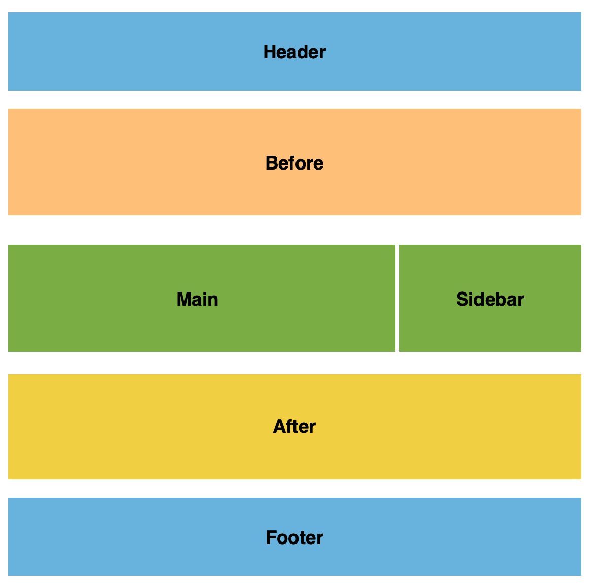

# Syntax

MorfLess uses a template syntax that is a simplified version of the PoliMorf syntax. 

Schematic files (templates) are used to create the html page on the site. Syntax contained in other files can be referenced and will be imported into the file. 

## Schematic Requirements

The schematics are simple text files with the following tags:

    ///META:
    title={ A title }:
    url={ /path-to-page/ }:
    
    ///HEADER:
    <various commands>
    
    ///BEFORE:
    <various commands>
    
    ///MAIN:
    <various commands>
    
    ///AFTER:
    <various commands>
    
    ///SIDEBAR:
    <various commands>
    
    ///FOOTER:
    <various commands>
    
 For the schematic to be processed the following elements are needed:
 
 - META tag with title and url keyword
 - The HEADER, MAIN and FOOTER tag
 
 The BEFORE, AFTER and SIDEBAR tags are optional. Other meta tags are also optional.
 
 MorfLess has the capability to display a page with either a full-width style or two-column style (main and sidebar). Note that if there is no Sidebar defined, Main is full-width
 
 

 
 

 
 ### File extensions
 
 Though MorfLess will trigger on any file upload, RenderHtml will perform processing in the following cases:
 
 - A file ending in ".post" or ".page" is uploaded. 
 - A file that isn't HTML or JSON is uploaded
 
 If a non post/page file is uploaded, RenderHtml will check it is included in the dependencies.json file stored in the List Bucket. 

If it is, a list of files that are dependent on the uploaded file will be created and processed. If not the single file is processed. Dependent files can be settings.txt (if the DEFAULT command is used) or any inserted files (if the INSERT command is used)

When a file is deleted, it is removed from the master list of posts and pages (postlist.json) as well as the website bucket. The file, dependencies.json, will be amended only when the dependent file is updated. This is trivial for the deleted file as content for that file will not be visible.

## Identifiers

The syntax is organised using 3 types of identifiers:

- Schematic commands idenfied by %%<command>::
- Sub commands identified by <sub_command>=[ <syntax> ]:
- Keyword identified by <keyword>={ <syntax> }:

The exception is for table elements called Boxes:

For example, a 3-elements box (3BOX) is called as follows:

        %%3_BOX::
        BOX1:
        <sub_command>=[ ]:
        
        BOX2:
        <sub_command>=[ ]:
        
        BOX3:
        <sub_command>=[ ]:
        
If the BOXn elements are not present the nBOX will not be processed. Currently there is support for 2, 3 and 4 Boxes.

For sub-commands and keywords the opening syntax ***must be written without spaces*** from the sub-command or keyword. Spaces can be used in the syntax and after the closing identifier syntax.

## Sections

Elements can be grouped into a general Section element (different than an HTML5 section tag). This is done so things like a common background can be added. To add a Section, the command structure is slightly altered. Using the 3BOX example, the command identifiers are altered to start and end with a square bracket, and a Section id needs to be present:

        %%SECTION::
        {{ <section-id> }}
        [%3_BOX:]
        BOX1:
        <sub_command>=[ ]:
        
        BOX2:
        <sub_command>=[ ]:
        
        BOX3:
        <sub_command>=[ ]:
        
 ## Custom classes
 
 Custom classes can be added to commands by using a CUSTOM tag as follows:
 
        %%SECTION_CUSTOM: custom-class ::
        {{ <section-id> }}
        [%3_BOX:]
        BOX1:
        <sub_command>=[ ]:
        
        BOX2:
        <sub_command>=[ ]:
        
        BOX3:
        <sub_command>=[ ]:
