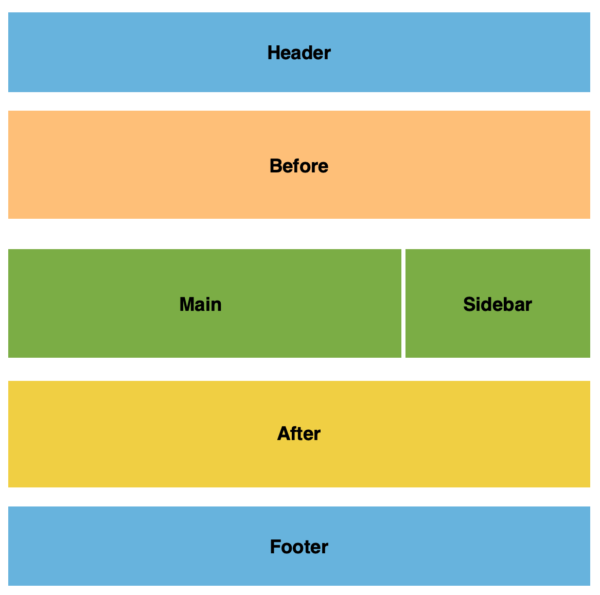

# Syntax

MorfLess uses a template syntax that is a simplified version of the PoliMorf syntax. 

Schematic files (templates) are used to create the html page on the site. Syntax contained in other files can be referenced and will be imported into the file. 

## Schematic Requirements

The schematics are simple text files with the following tags:

    ///META:
    title={ A title }:
    url={ /path-to-page/ }:
    
    ///HEADER:
    <various commands>
    
    ///BEFORE:
    <various commands>
    
    ///MAIN:
    <various commands>
    
    ///AFTER:
    <various commands>
    
    ///SIDEBAR:
    <various commands>
    
    ///FOOTER:
    <various commands>
    
 For the schematic to be processed the following elements are needed:
 
 - META tag with title and url keyword
 - The HEADER, MAIN and FOOTER tag
 
 The BEFORE, AFTER and SIDEBAR tags are optional. Other meta tags are also optional.
 
 MorfLess has the capability to display a page with either a full-width style or two-column style (main and sidebar). Note that if there is no Sidebar defined, Main is full-width
 
 

 
 

 
 ### File extensions
 
 MorfLess will trigger in the following cases:
 
 - A file ending in ".post" or ".page" is uploaded. 
 - A file that isn't HTML or JSON is uploaded
 
 If a non post/page file is uploaded, RenderHtml will check it is included in the dependencies.json file stored in the List Bucket. 

If it is, a list of files that are dependent on the uploaded file will be created and processed. If not the single file is processed. Dependent files can be settings.txt (if the DEFAULT command is used) or any inserted files (if the INSERT command is used)
